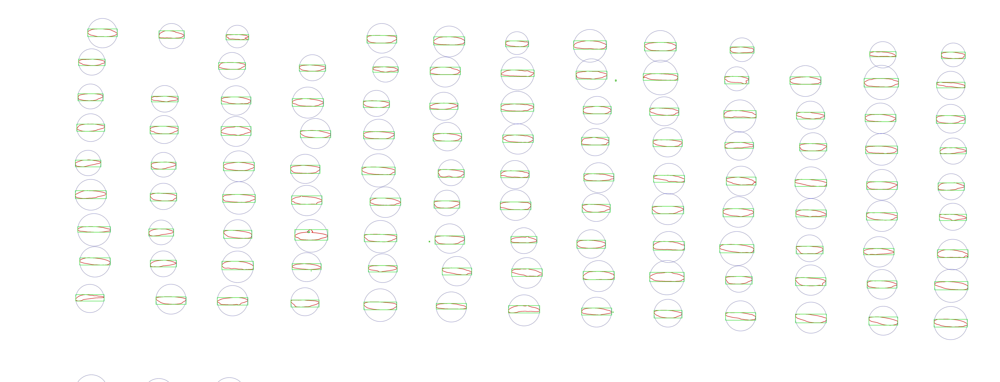

### Type 1: Rice seeds on blue background

* Step 1: Load original image

* Step 2: Create a binary mask

* Step 3: Run canny edge detector

* Step 4: use detected edges to find contours 

* Step 5: Generate bounding box and circles from contours 

* Step 6: Sample crops of image containing rice seeds
